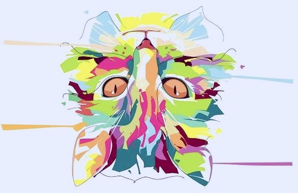
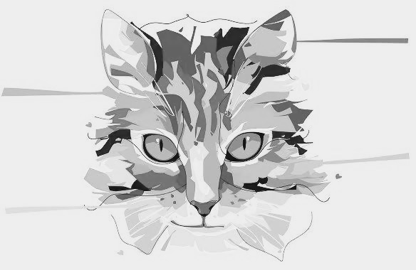

<div align="center">

<h1>GoImg</h1>

[](https://github.com/a5chin/goImg/actions/workflows/gotest.yml) [](https://img.shields.io/pypi/l/ansicolortags.svg)

[](https://go.dev/)

</div>

## Usage
Currently
- Flip
- Grayscale 

are implemented.

### Flip (Holizontal, Vertical)
```go
package main

import "goimg"

func main() {
	img := LoadImage("assets/images/cat.jpg")

    // (h)olizontal or (v)ertical
	fliped := img.Flip("v")
	fliped.Save("assets/images/fliped.png")
}
```


### GrayScale
```go
package main

import "goimg"

func main() {
	img := LoadImage("assets/images/cat.jpg")
	gray := img.Gray()
	gray.Save("assets/images/gray.png")
}
```



